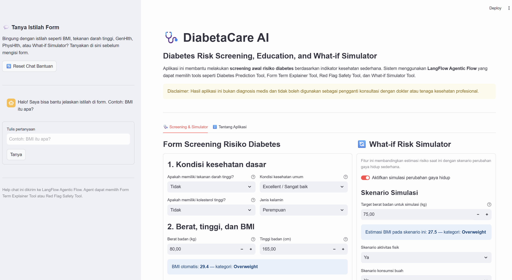
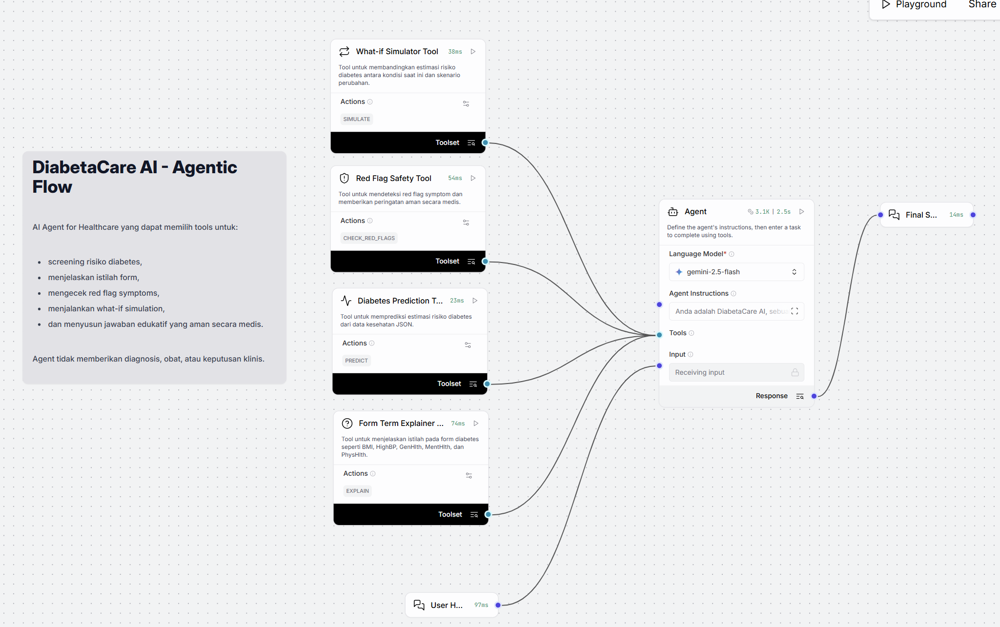
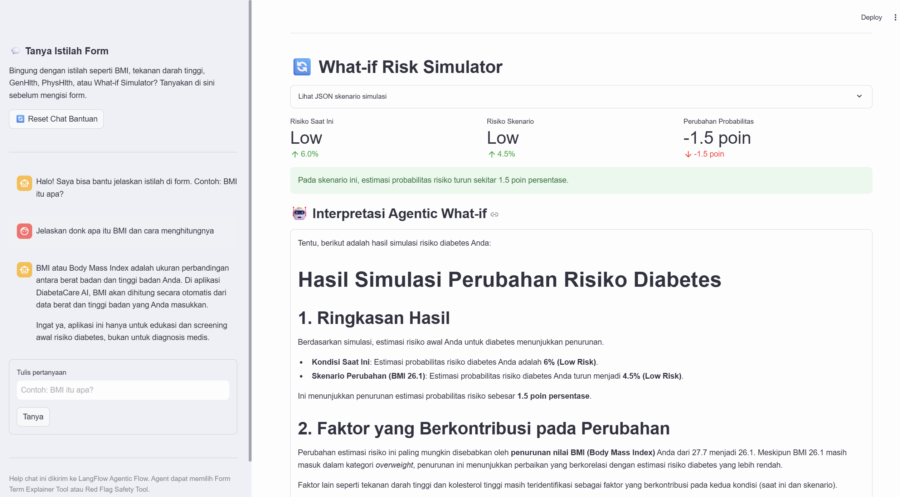

# DiabetaCare AI: Agentic Diabetes Risk Screening Assistant

DiabetaCare AI is an **AI Agent for Healthcare** project that combines **LangFlow Agentic Flow**, **FastAPI**, **Random Forest**, **Gemini**, and **Streamlit** to support early diabetes risk awareness.

The system helps users fill out a health screening form, estimate diabetes risk, ask about health-related form terms, simulate lifestyle-change scenarios, and receive safe educational explanations.

> **Medical disclaimer:** This application is for education and early risk awareness only. It is not a diagnostic tool and does not replace consultation with doctors or licensed healthcare professionals.

---
## Table of Contents

- [Project Goals](#project-goals)
- [Key Features](#key-features)
- [System Architecture](#system-architecture)
- [Main Workflows](#main-workflows)
- [Dataset](#dataset)
- [Machine Learning Model](#machine-learning-model)
- [Tech Stack](#tech-stack)
- [Project Structure](#project-structure)
- [Environment Variables and Secret Management](#environment-variables-and-secret-management)
- [Secure Configuration Recommendation](#secure-configuration-recommendation)
- [Installation](#installation)
- [How to Run Locally](#how-to-run-locally)
- [LangFlow Agentic Flow](#langflow-agentic-flow)
- [Example Input](#example-input)
- [Example Agent Behavior](#example-agent-behavior)
- [Demo Screenshots](#demo-screenshots)
- [Medical Disclaimer](#medical-disclaimer)
- [Limitations](#limitations)
- [Future Improvements](#future-improvements)
- [Project Pitch](#project-pitch)
- [Author](#author)

---
## Project Goals

DiabetaCare AI was built to demonstrate how an AI Agent can support a healthcare-related screening workflow while maintaining safety boundaries.

The project focuses on:

- Early diabetes risk screening
- Agent-based tool selection
- Patient-friendly explanation
- Health form term clarification
- What-if risk simulation
- Medical safety guardrails
- Simple and accessible Streamlit user interface

---

## Key Features

### 1. Health Screening Form

Users can enter health indicators through a Streamlit form without writing JSON manually.

The form includes:

- High blood pressure status
- High cholesterol status
- Weight and height
- Automatically calculated BMI
- Smoking history
- Physical activity
- Fruit and vegetable consumption
- General health condition
- Mental health days
- Physical health days
- Age category
- Sex

---

### 2. Automatic BMI Calculation

The app calculates BMI automatically from weight and height.

```text
BMI = weight in kg / (height in meters ^ 2)
```

The app also displays the BMI category, such as:

- Underweight
- Normal
- Overweight
- Obesity

---

### 3. LangFlow Agentic Flow

The application uses a LangFlow Agentic Flow instead of a simple linear chatbot.

The agent can select tools depending on user intent.

Available tools:

| Tool | Purpose |
|---|---|
| Diabetes Prediction Tool | Runs diabetes risk screening using the prediction API |
| Form Term Explainer Tool | Explains terms such as BMI, HighBP, GenHlth, MentHlth, and PhysHlth |
| Red Flag Safety Tool | Detects symptom-related messages that need safer medical wording |
| What-if Simulator Tool | Compares current risk estimation with a lifestyle-change scenario |

---

### 4. Diabetes Prediction Tool

When the user submits the health form, Streamlit sends a task to the LangFlow Agentic Flow.

The agent then uses the **Diabetes Prediction Tool** to process the health indicator data.

The prediction output includes:

- Risk level
- Diabetes probability
- Contributing factors
- Medical disclaimer

---

### 5. Help Chat with Agentic Flow

The sidebar includes a help chat where users can ask questions such as:

```text
BMI itu apa?
GenHlth maksudnya apa?
Cara mengukur BMI gimana?
What-if Simulator itu apa?
```

These questions are sent to the LangFlow Agentic Flow, and the agent can choose the **Form Term Explainer Tool** or **Red Flag Safety Tool** depending on the user message.

---

### 6. Red Flag Safety Handling

If a user mentions symptoms such as:

- Frequent thirst
- Frequent urination
- Unexplained weight loss
- Slow-healing wounds
- Blurry vision
- Severe weakness

The agent can use the **Red Flag Safety Tool** to provide a cautious safety response.

The system avoids diagnosis and encourages the user to consult a healthcare professional when symptoms need attention.

---

### 7. What-if Risk Simulator

The What-if Risk Simulator allows users to compare current risk with a simulated lifestyle-change scenario.

Example scenario changes:

- Lower target weight
- Increased physical activity
- Improved fruit consumption
- Improved vegetable consumption
- No smoking

The UI displays:

- Current risk level
- Scenario risk level
- Probability change
- Contributing factors
- Agentic interpretation of the simulation

The metric cards are calculated using the prediction API, while the narrative interpretation is generated through the LangFlow Agentic Flow.

---

### 8. 7-Day Wellness Plan

The app generates a 7-day wellness plan based on user input and prediction output.

The plan may include general recommendations such as:

- Recording baseline health condition
- Starting light physical activity
- Adding fruit or vegetables
- Monitoring health indicators
- Considering consultation with healthcare professionals when appropriate

The plan is educational and general, not personalized medical treatment.

---

## System Architecture

```text
Streamlit UI
    |
    v
LangFlow Agentic Flow
    |
    v
Agent selects a tool
    |-----------------------------|
    | Diabetes Prediction Tool     |
    | Form Term Explainer Tool     |
    | Red Flag Safety Tool         |
    | What-if Simulator Tool       |
    |-----------------------------|
    |
    v
Gemini-based explanation
    |
    v
Final user-facing result
```

---

## Main Workflows

### Screening Workflow

```text
User fills health form
    ↓
Streamlit sends task to LangFlow Agentic Flow
    ↓
Agent selects Diabetes Prediction Tool
    ↓
Prediction API runs Random Forest model
    ↓
Agent receives risk result
    ↓
Agent creates patient-friendly explanation
    ↓
Streamlit displays screening result
```

---

### Help Chat Workflow

```text
User asks a form-related question
    ↓
Streamlit sends question to LangFlow Agentic Flow
    ↓
Agent selects Form Term Explainer Tool
    ↓
Agent returns simple explanation
    ↓
Streamlit sidebar displays response
```

---

### Red Flag Safety Workflow

```text
User mentions concerning symptoms
    ↓
Streamlit sends message to LangFlow Agentic Flow
    ↓
Agent selects Red Flag Safety Tool
    ↓
Agent returns safety-focused response
```

---

### What-if Simulation Workflow

```text
User creates a scenario
    ↓
Streamlit creates current and scenario payloads
    ↓
Prediction API calculates metric comparison
    ↓
LangFlow Agentic Flow creates narrative interpretation
    ↓
Streamlit displays metric cards and explanation
```

---

## Dataset

The model is based on the **CDC Diabetes Health Indicators** dataset from the UCI Machine Learning Repository.

The app uses selected features:

```text
HighBP
HighChol
BMI
Smoker
PhysActivity
Fruits
Veggies
GenHlth
MentHlth
PhysHlth
Age
Sex
```

---

## Machine Learning Model

The prediction model uses **Random Forest Classifier**.

The model returns:

```text
prediction
diabetes_probability
risk_level
contributing_factors
disclaimer
```

Example response structure:

```json
{
  "prediction": 1,
  "diabetes_probability": 0.518,
  "risk_level": "Moderate",
  "contributing_factors": [
    "high blood pressure",
    "high cholesterol",
    "BMI in obesity category",
    "low physical activity"
  ],
  "disclaimer": "This result is for early screening only and is not a medical diagnosis."
}
```

---

## Tech Stack

| Layer | Technology |
|---|---|
| User Interface | Streamlit |
| Agentic Workflow | LangFlow |
| LLM | Gemini |
| Prediction API | FastAPI |
| Machine Learning | Random Forest |
| Data Processing | pandas |
| Model Serialization | joblib |
| Programming Language | Python |

---

## Project Structure

Recommended structure:

```text
diabetacare-ai/
│
├── api/
│   └── app.py
│
├── model/
│   ├── diabetes_model.pkl
│   └── selected_features.pkl
│
├── notebook/
│   └── diabetes_model_training.ipynb
│
├── ui/
│   └── app.py
│
├── langflow/
│   └── agentic_flow.json
│
├── screenshots/
│   ├── streamlit_ui.png
│   ├── langflow_agentic_flow.png
│   └── screening_result.png
│
├── .streamlit/
│   └── secrets.toml
│
├── requirements.txt
├── .gitignore
└── README.md
```

---

## Environment Variables and Secret Management

Create a Streamlit secrets file:

```text
.streamlit/secrets.toml
```

Example:

```toml
LANGFLOW_API_KEY = "your_langflow_api_key_here"
LANGFLOW_URL = "your_langflow_agentic_flow_endpoint_here"
FASTAPI_PREDICT_URL = "your_prediction_api_endpoint_here"
```

Do **not** commit credentials, API keys, local service URLs, or flow IDs to GitHub.

Recommended `.gitignore`:

```gitignore
.streamlit/secrets.toml
.env
__pycache__/
*.pyc
.ipynb_checkpoints/
```

---

## Secure Configuration Recommendation

For public repositories, avoid hardcoding service endpoints inside `ui/app.py`.

Recommended approach:

```python
LANGFLOW_URL = st.secrets["LANGFLOW_URL"]
FASTAPI_PREDICT_URL = st.secrets["FASTAPI_PREDICT_URL"]
```

This keeps sensitive or environment-specific configuration outside the source code.

---

## Installation

Install dependencies:

```bash
pip install -r requirements.txt
```

Example `requirements.txt`:

```text
fastapi
uvicorn
pandas
scikit-learn
joblib
pydantic
streamlit
requests
langflow
ucimlrepo
```

If using `uv`:

```bash
uv add fastapi uvicorn pandas scikit-learn joblib pydantic streamlit requests langflow ucimlrepo
```

---

## How to Run Locally

This project requires three services.

### 1. Run the prediction API

```bash
uvicorn api.app:app --reload
```

### 2. Run LangFlow

```bash
langflow run
```

Make sure the Agentic Flow is imported and available in LangFlow.

### 3. Run Streamlit

```bash
streamlit run ui/app.py
```

---

## LangFlow Agentic Flow

The LangFlow flow uses:

```text
Chat Input
    ↓
Agent
    ↓
Chat Output
```

Tools connected to the Agent:

```text
Diabetes Prediction Tool  ─┐
Form Term Explainer Tool  ─┤
Red Flag Safety Tool      ─┤→ Agent Tools
What-if Simulator Tool    ─┘
```

The agent uses Gemini and receives instructions to:

- Use Diabetes Prediction Tool for health indicator data
- Use Form Term Explainer Tool for form-related questions
- Use Red Flag Safety Tool for concerning symptom messages
- Use What-if Simulator Tool for current vs scenario comparison
- Avoid diagnosis, medication, dosage, or clinical decisions
- Use safe wording and include a medical disclaimer

---

## Example Input

```json
{
  "HighBP": 1,
  "HighChol": 1,
  "BMI": 32,
  "Smoker": 1,
  "PhysActivity": 0,
  "Fruits": 0,
  "Veggies": 1,
  "GenHlth": 4,
  "MentHlth": 5,
  "PhysHlth": 10,
  "Age": 9,
  "Sex": 1
}
```

---

## Example Agent Behavior

### Diabetes Screening

```text
User submits health form
Agent calls Diabetes Prediction Tool
Agent returns screening explanation
```

---

### Form Term Explanation

```text
User: BMI itu apa?
Agent calls Form Term Explainer Tool
Agent explains BMI in simple language
```

---

### Red Flag Safety

```text
User: Saya sering haus dan sering buang air kecil.
Agent calls Red Flag Safety Tool
Agent provides safety-focused response
```

---

### What-if Simulation

```text
User submits current and scenario data
Agent calls What-if Simulator Tool
Agent explains the simulated difference
```

---


## Demo Screenshots

### Streamlit User Interface



### LangFlow Agentic Flow



### Screening Result



---

## Medical Disclaimer

DiabetaCare AI is intended for **education and early risk awareness only**.

This system:

- Does not diagnose diabetes
- Does not replace doctors or healthcare professionals
- Does not prescribe medication
- Does not provide dosage recommendations
- Does not make clinical decisions

If users experience concerning symptoms or have health concerns, they should consult a licensed healthcare professional.

---

## Limitations

- The model is trained on a public health indicator dataset, not clinical records.
- The app does not use laboratory values such as HbA1c or fasting blood glucose.
- The prediction is probabilistic and should not be interpreted as diagnosis.
- The What-if Simulator is educational and does not guarantee real-world health outcomes.
- The 7-Day Wellness Plan is general and not personalized medical treatment.
- The app currently runs locally and requires separate services for FastAPI, LangFlow, and Streamlit.

---

## Future Improvements

Potential improvements:

- Add Retrieval-Augmented Generation using trusted diabetes education documents
- Add SHAP explainability for model interpretation
- Add natural language health data intake
- Add PDF report export
- Add risk history tracking
- Add Docker deployment
- Add secure authentication
- Add multilingual support
- Add fairness and bias evaluation
- Add cloud deployment

---

## Project Pitch

**DiabetaCare AI** is an AI Agent for Healthcare that combines diabetes risk prediction, LangFlow agentic tool selection, Gemini-based explanation, What-if simulation, and medical safety guardrails. The system helps users understand early diabetes risk signals, explore lifestyle-change scenarios, and receive safe educational guidance without replacing professional medical consultation.

---

## Author

Created as a portfolio project for an **AI Agent for Healthcare** course.
